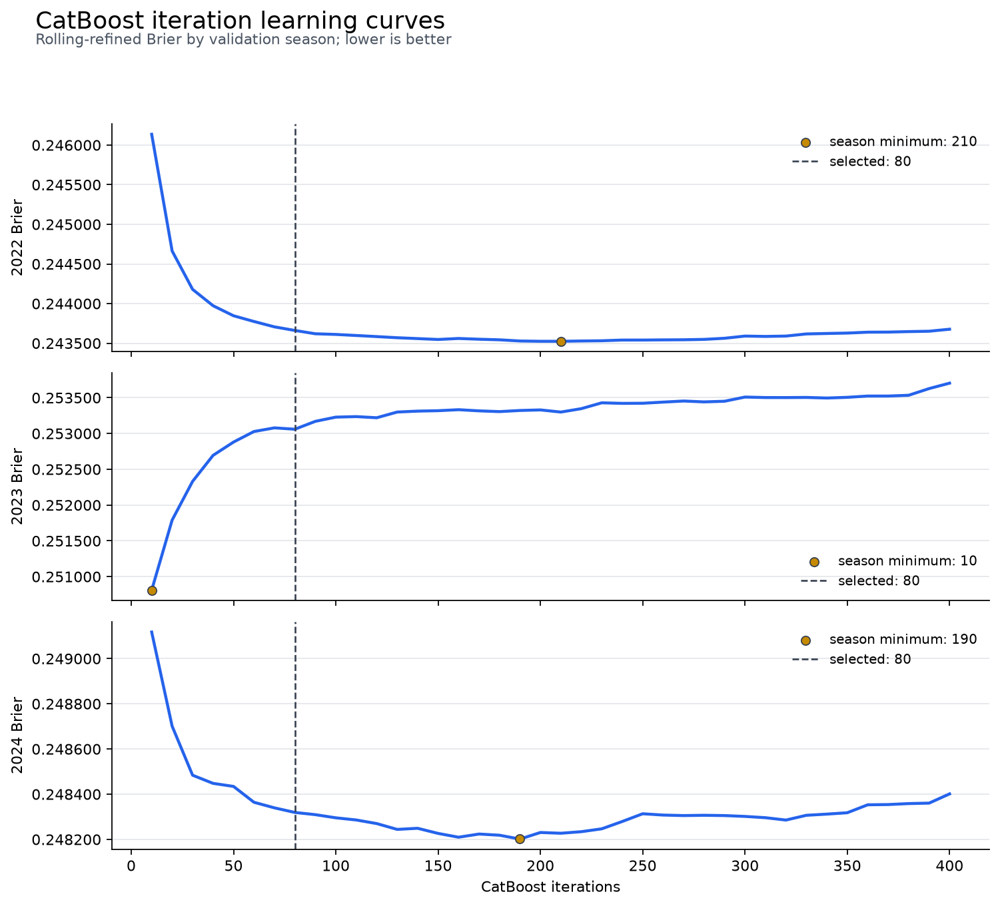

# 1,000점 돌파 전략 진행 기록

- 작성일: 2026-08-17
- 기준 모델: 시간창 앙상블 + `game_type` 보정 + Rolling 전체 로짓 보정
- 기준 2024 Brier: **0.24799999**
- 기준 로컬 예상 점수: **723.33442점**
- 기준 모델 공식 리더보드 점수: **799.5807811031점**
- 현재 최고 공식 리더보드 점수: **852.1984993386점** (`logit -0.0461`)
- 목표 Brier: **0.24730886 이하**
- 필요한 Brier 개선량: **0.00069113**
- 목표 로컬 예상 점수: **1,000점 이상**

## 기술 요약

추가 Optuna나 XGBoost 단독 튜닝보다 서로 다른 오차 원인을 다루는 네 축을 결합한다.

1. 2025 리더보드 기반 저차원 전역 로짓 보정
2. `game_type`과 신규 투수 효과를 부분 풀링하는 계층형 시즌 보정
3. 신규·저표본 투수 전용 fallback과 부드러운 게이팅
4. 운영진 확인을 전제로 한 Trackman 확률적 선수 매핑
5. CatBoost와 고편향 residual 분기를 포함한 저상관 OOF 스태킹

`723.33442점`은 전역 로짓 이동 전의 과거 로컬 기준선으로만 보존한다. 실험 1에서
`logit -0.0461`이 공식 `852.1984993386점`으로 채택된 뒤부터는 이 이동까지 포함한 전체
구조를 기준선으로 고정한다. 이후 구조 실험은 기준선과 후보 양쪽에 동일한 `-0.0461`을
적용하며, paired Brier 개선이 없으면 채택하지 않는다.

## 검증한 데이터 현상

다음 값은 `data/train.csv`에서 다시 계산했다.

| 시즌 | 신규 투수 행 비율 | 실제 성공률 | 투수 as-of 평균 | 실제-과거 평균 |
|---:|---:|---:|---:|---:|
| 2022 | 15.7392% | 52.8920% | 53.5402% | -0.6481%p |
| 2023 | 13.7982% | 49.9957% | 52.3730% | -2.3773%p |
| 2024 | **19.8606%** | 48.6105% | 51.1397% | **-2.5292%p** |

신규 투수는 해당 시즌보다 이전 데이터에 `pitcher_id`가 한 번도 등장하지 않은 투수로
정의한다. 2024년에는 391명 중 81명이 신규 투수였고 이들이 50,348개 투구를 담당했다.

| 시즌 | `game_type=F` 행 수 | `F` 성공률 | `game_type=R` 행 수 | `R` 성공률 |
|---:|---:|---:|---:|---:|
| 2022 | 30,448 | 70.8749% | 217,024 | 50.3691% |
| 2023 | 25,686 | 47.2904% | 219,839 | 50.3118% |
| 2024 | 30,010 | 45.9280% | 223,497 | 48.9707% |

`game_type=F`의 관계가 한 시즌 사이에 급변하므로 유형별 보정은 반드시 부분 풀링하고,
한 시즌에서 선택한 강한 보정이 다음 시즌에도 유지된다고 가정하지 않는다.

## 채택 기준

후보는 다음 세 조건을 동시에 만족해야 한다.

1. 2022→2023→2024 rolling OOF 합산 paired Brier가 현재 모델보다 개선
2. 2024 전체 Brier가 현재 모델보다 악화되지 않음
3. 2024 신규 투수 코호트 Brier가 현재 모델보다 악화되지 않음

추가로 다음 운영 조건을 확인한다.

- 테스트 데이터 내부 통계나 정답을 사용하지 않음
- 245,789행 추론이 10분, RAM 28GB 제한 안에서 완료
- 제출 ZIP 압축 크기 10GB, 압축 해제 크기 32GB 이하
- 복잡도 증가가 작은 Brier 개선에 비해 과도하지 않음

## 실험 진행표

| 순서 | 실험 | 상태 | 채택 판단 |
|---:|---|---|---|
| 0 | 로짓 이동 전 723.33442점 모델 기록 | 완료 | 과거 로컬 기준선 |
| 1 | 2025 리더보드 전역 로짓 이동 | 완료·채택 | `-0.0461`에서 852.19850점 |
| 2 | 계층형 시즌·`game_type`·신규 투수 보정 | 완료·기각 | 2024 전체와 신규 투수 모두 악화 |
| 3 | 신규·저표본 투수 fallback 게이팅 | 완료·기각 | 2024 전체와 신규 투수 모두 소폭 악화 |
| 4 | Trackman 확률적 선수 매핑 | 완료·기각 | 개발 최적 비중 0%, 2024 전체·매핑 코호트 악화 |
| 5 | 저상관 OOF 스태킹 + 매핑 ablation | 완료·기각 | 두 스택 모두 2024 급락, 매핑 효과 불확실 |

## 실험 1: 2025 리더보드 전역 로짓 이동

### 목적

실제 평가 데이터의 확률 수준이 현재 모델보다 전체적으로 높거나 낮은지 확인한다.

### 방법

```text
logit(p) - δ
logit(p)
logit(p) + δ
```

기준 제출 점수와 한 방향 후보를 먼저 확인한다. 점수가 개선된 방향에서만 두 번째 후보를
사용하고, 세 점의 점수를 2차식으로 보간해 최적 절편을 추정한다. 이 방법은 순위가 아니라
확률 수준만 조정하므로 제출 횟수를 최소화해야 한다.

### 현재 상태

기준 ZIP `submit_temporal_refined.zip`의 공식 점수는 `799.5807811031점`이다. 로컬 예상
`723.33442점`보다 `76.24636점` 높아 제출 재현성과 기준 모델의 일반화 가능성을 확인했다.

2022·2023·2024 OOF에서 현재 보정 확률에 추가로 필요한 최적 로짓 절편을 계산하면 각각
`-0.00248`, `-0.08637`, `-0.01886`이다. 세 시즌 모두 음수 방향이므로 첫 탐색 후보는
2024 값을 반올림한 `δ=-0.02`로 정했다.

| 리더보드 후보 | 추가 로짓 이동 | 공식 점수 | 상태 |
|---|---:|---:|---|
| 기준 시간창 + 두 후단 보정 | 0 | 799.5807811031 | 제출 완료 |
| 1차 확률 하향 후보 | -0.02 | **835.3365464969** | 제출 완료, 기준 대비 +35.7557653938 |
| 2차 확률 하향 후보 | -0.04 | **851.2713651591** | 제출 완료, 직전 대비 +15.9348186622 |
| 2차식 정점 후보 | -0.0461 | **852.1984993386** | 제출 완료·최종 채택 |

`-0.02`와 `-0.04`에서 연속으로 개선돼 확률 하향 방향이 맞음을 확인했다. 공식 세 점에
다음 2차식을 적합했다.

```text
Score(δ) = -24776.1834 δ² - 2283.31194 δ + 799.5807811
```

추정 정점은 `δ=-0.04607877`, 예상 점수는 `852.18688점`이다. 반올림한 총 이동
`-0.0461`을 최종 전역 보정 후보로 생성했다. 제출 파일은 다음과 같다.

```text
artifacts/submissions/submit_temporal_refined046.zip
```

로컬 5행 샘플의 평균 확률은 기준 `0.46785006`, `-0.02` 후보 `0.46288906`, `-0.04` 후보
`0.45793536`, 정점 후보 `0.45642608`이다. 새 ZIP은 무결성과 격리 추론을 통과했다.
정점 후보의 실제 점수는 초기 세 점의 예상 `852.18687986`보다 `0.01162점` 높았다. 네 점을
다시 적합한 정점은 `-0.04609332`로 제출값 `-0.0461`과 사실상 같다. 기준 모델 대비 총
`+52.61771824점`을 얻었으며 추가 절편 탐색은 종료하고 다음 구조적 실험으로 이동한다.

공식 점수 기록은 `artifacts/leaderboard_logit_shift/scores.csv`에 저장한다.
2차식 계산은 `fit_logit_shift_curve.py`로 재현하며 계수와 정점은
`artifacts/leaderboard_logit_shift/curve_fit.json`에 저장한다.

## 실험 2: 계층형 시즌 보정

### 목적

고정 전역 절편보다 `game_type`과 신규·저표본 투수의 반복적인 오차만 부분 풀링해 보정한다.

### 설계

- 기본 확률: 보정 전 시간창 앙상블 OOF
- 전역 항: logit 또는 beta calibration
- 계층 항: `game_type`, 신규 투수 여부, `asof_pitcher_n < 100`,
  `log1p(asof_pitcher_n)`
- 규제: 표준화 후 L2 logistic regression
- 선택: 2022 OOF로 학습하고 2023 Brier로 설정 선택
- outer: 선택 설정을 2022·2023 OOF로 재학습하고 2024에서 한 번 평가

### 결과

2022로 학습하고 2023에서 선택한 최적 후보는 계층형 항을 포함한 모델이 아니라
`global_logit`, `C=0.000003`이었다. 2023 Brier는 원본 시간창 앙상블의 `0.25402117`에서
`0.25069598`로 낮아졌지만, 이 관계는 다음 시즌에 유지되지 않았다.

| 2024 outer 모델 | 전체 Brier | 예상 점수 | 신규 투수 Brier | 평균 예측 |
|---|---:|---:|---:|---:|
| 원본 시간창 앙상블 | 0.24805506 | 701.28755 | 0.24781960 | 0.495029 |
| 현재 두 후단 보정 모델 | **0.24799999** | **723.33442** | **0.24777902** | 0.490789 |
| 선택된 계층형 실험 후보 | 0.24993633 | 0 | 0.24987317 | 0.507610 |

후보는 현재 모델보다 Brier가 `0.00193634` 악화됐다. candidate-minus-current paired Brier
95% 신뢰구간은 `[+0.00178818, +0.00208451]`로 전체가 악화 방향이다. 신규 투수 Brier도
`0.00209415` 나빠져 세 채택 조건을 모두 통과하지 못했다.

결론은 **기각하고 현재 `723.33442점` 모델을 유지**하는 것이다. 2023 한 시즌에서 관측한
강한 확률 수준 변화가 2024에 같은 방식으로 이어지지 않았다. 계층 특성을 추가하는 것만으로
시간 드리프트가 해결되지 않았고, 오히려 평균 예측을 `0.507610`까지 올려 2024 실제 평균
`0.486105`에서 멀어졌다.

재현 명령과 산출물은 다음과 같다.

```bash
.venv/bin/python experiment_hierarchical_calibration.py
```

- `artifacts/hierarchical_calibration/selection_metrics.csv`
- `artifacts/hierarchical_calibration/outer_metrics.csv`
- `artifacts/hierarchical_calibration/run_summary.json`
- 대용량 `outer_predictions.csv`는 Git에서 제외했다.

## 실험 3: 신규 투수 fallback

다음 두 분기의 확률을 `log1p(asof_pitcher_n)` 기반 게이트로 부드럽게 결합한다.

- 기존 투수 분기: 현재 시간창 앙상블과 누적 기록 중심
- 신규·저표본 분기: 선수 ID 효과를 제외하고 팀·손잡이·카운트·주자·경기 상황 중심

게이트는 신규 투수 여부를 이진 분기하는 대신 표본 수가 늘수록 기존 투수 모델의 비중이
증가하도록 한다. 전체 성능만 개선되고 신규 투수 성능이 악화되거나 그 반대인 후보는
채택하지 않는다.

### 실제 실험 구조

공식 최고점 `852.1984993386점` 모델을 기준으로 마지막 `logit -0.0461`을 고정했다.
fallback은 현재 33개 피처 중 `asof_pitcher_n`만 신뢰도 변수로 남기고 투수 성공률·직전
경기·구종 구성 이력 11개를 제거한 HistGB 45% + ExtraTrees 55%로 구성했다.

```text
현재 시간창 모델 + 상황 중심 fallback
        ↓ 신규 여부와 asof_pitcher_n 게이트
game_type·Rolling 보정
        ↓ 고정 logit -0.0461
후보 확률
```

2022·2023에서 `전체`, `신규만`, `신규 또는 저표본` 세 게이트와 `λ=1~1000`, 저표본
기준 `25·50·100·200`을 비교했다. 선택된 설정은 `신규 또는 asof_pitcher_n<50`, `λ=1`로
fallback 비중이 매우 작았다.

### fallback 단독 성능

| 검증 시즌 | fallback Brier | 예상 점수 |
|---:|---:|---:|
| 2022 | 0.24444676 | 1,893.07334 |
| 2023 | 0.25551200 | 0 |
| 2024 | 0.24939150 | 166.30081 |

fallback은 선수 이력을 제거하면서 현재 모델과 다른 오차를 만들었지만 단독 신호가 너무
약했다. 개발 구간에서 선택된 게이트도 기준 objective를 `0.00000164` 낮추는 데 그쳤다.

### 2024 outer 결과

| 모델 | 전체 Brier | 로컬 점수 | 신규 투수 Brier | 기존 투수 Brier |
|---|---:|---:|---:|---:|
| 공식 852점 구조의 로컬 기준 | **0.24802396** | **713.73877** | **0.24786399** | **0.24806360** |
| 신규 투수 fallback 후보 | 0.24802562 | 713.07401 | 0.24787234 | 0.24806361 |

후보의 Brier는 전체에서 `+0.00000166`, 신규 투수에서 `+0.00000835` 악화됐다.
candidate-minus-baseline paired Brier 95% 신뢰구간은
`[-0.00000073, +0.00000405]`로 0을 포함한다. 기존 투수는 거의 변하지 않았지만 목표
코호트인 신규 투수가 악화되어 채택 조건을 충족하지 못했다.

결론은 **기각하고 공식 852.198499점 모델을 유지**하는 것이다. 투수 이력 피처를 일괄
제거한 상황 모델은 신규 투수에게도 충분한 독립 신호를 제공하지 못했다. 다음 신규 투수
접근에서는 단순 제거보다 선수·팀 사전분포, 데뷔 후 현재 시즌 내 누적 이력, 또는 Trackman
물리 신호처럼 실제로 새로운 정보가 필요하다.

재현 명령과 산출물은 다음과 같다.

```bash
.venv/bin/python experiment_new_pitcher_fallback.py
```

- `artifacts/new_pitcher_fallback/fallback_fold_metrics.csv`
- `artifacts/new_pitcher_fallback/gate_selection_metrics.csv`
- `artifacts/new_pitcher_fallback/outer_metrics.csv`
- `artifacts/new_pitcher_fallback/run_summary.json`
- 대용량 OOF 캐시와 `outer_predictions.csv`는 Git에서 제외

## 실험 4: Trackman 확률적 선수 매핑

직접 ID 교집합이 없으므로 행 단위 조인을 하지 않았다. 메인 `asof` 구종 구성, 시즌별
투구량, 손잡이를 Trackman 투수별 과거 분포와 비교하고 손잡이 안에서 Hungarian 일대일
할당을 적용했다. 매핑과 물리 피처는 각 행의 시즌보다 이전 시즌 기록만 사용한다.

### 매핑 채택 기준

- 구종 구성 L1 비용 `≤0.025`
- 누적 투구 수 상대 비용 `≤0.5`
- 시즌별 투구량 비용 `≤0.4`
- 1·2위 후보 비용 차이 `≥0.01`
- 과거 표본 `≥50`, 상호 최근접 후보만 허용

이 기준은 2022→2023과 2023→2024에서 공통으로 관측된 매핑 21개가 모두 같은 Trackman
ID를 유지해 **매핑 안정성 100%**를 기록했다. 대신 2024에는 395개 할당 후보 중 26개만
채택됐고, 이들이 담당한 행은 12,115개로 전체의 **4.77896%**였다.

채택된 투수에는 표본 수 200을 기준으로 손잡이 평균에 수축한 다음 피처를 추가했다.

- 구속, 회전수, 수직·수평 무브먼트
- 익스텐션, 릴리스 높이·좌우 위치, 플레이트 근처 구속
- 각 물리 변수의 투수별 표준편차
- fastball·breaking·offspeed 구종 비율
- Trackman 표본 수와 매핑 품질

Trackman 분기도 공식 모델과 동일한 HistGB 45% + ExtraTrees 55%, 세 시간창 비중,
`game_type`·Rolling 보정을 사용했다. 2022·2023에서 현재 모델과 Trackman 분기의 연속 혼합
비중을 선택하고, 양쪽 모두에 마지막 `logit -0.0461`을 적용한 뒤 2024를 한 번 평가했다.

### 2024 outer 결과

| 모델 | Trackman 비중 | 전체 Brier | 로컬 점수 | 매핑 코호트 Brier | 비매핑 Brier |
|---|---:|---:|---:|---:|---:|
| 공식 852점 구조 기준 | 0% | **0.24802396** | **713.73877** | **0.24771462** | **0.24803948** |
| Trackman 증강 분기 단독 | 100% | 0.24806504 | 697.29227 | 0.24792954 | 0.24807184 |
| 개발 구간 선택 혼합 | **0%** | **0.24802396** | **713.73877** | **0.24771462** | **0.24803948** |

Trackman 단독 분기는 기준보다 Brier가 `+0.00004108`, 점수가 `-16.44651점` 악화됐다.
핵심 대상인 매핑 코호트 Brier도 `+0.00021491` 나빠졌다. 2022·2023 robust objective가
선택한 최적 Trackman 비중은 정확히 `0%`였으므로 최종 후보는 기준 모델과 동일하고,
paired Brier 차이도 0이다.

결론은 **기각하고 공식 852.198499점 모델을 유지**하는 것이다. 보수적인 매핑은 안정적이지만
커버리지가 낮고, 추가된 과거 물리 평균이 이미 제공된 `asof` 구종 구성·성공률을 넘어서는
예측 신호를 만들지 못했다. 결과가 개선되지 않았으므로 규정 문의나 제출 ZIP 생성도 진행하지
않는다.

재현 명령과 산출물은 다음과 같다.

```bash
.venv/bin/python experiment_trackman_mapping.py
```

- `artifacts/trackman_mapping/mapping_assignments.csv`
- `artifacts/trackman_mapping/mapping_summary.csv`
- `artifacts/trackman_mapping/component_metrics.csv`
- `artifacts/trackman_mapping/blend_selection.csv`
- `artifacts/trackman_mapping/outer_metrics.csv`
- `artifacts/trackman_mapping/run_summary.json`
- 대용량 캐시와 `outer_predictions.csv`는 Git에서 제외

## 실험 5: 저상관 OOF 스태킹

사용자 결정에 따라 다음 세 구성을 동일한 2024 outer fold에서 비교했다.

1. 공식 852점 시간창 모델
2. CatBoost + spline/logistic OOF 스택, Trackman 매핑 없음
3. 동일한 OOF 스택에 실험 4의 Trackman 매핑 피처만 추가

두 스택은 매핑 피처 유무를 제외하고 학습 시즌, CatBoost·spline/logistic 설정,
`game_type`·Rolling 보정과 마지막 `logit -0.0461`을 동일하게 유지했다. CatBoost는 선수 ID를
OOV-safe 범주형으로 처리했고, 2024 정답으로 early stopping하지 않았다. 각 fold 직전 시즌을
내부 검증으로 반복 수를 정한 뒤 전체 과거 시즌으로 재학습했다.

2022·2023 OOF에서 현재 모델, CatBoost, spline/logistic의 비음수·합계 1 연속 비중을
선택했다. 매핑 사용 여부 역시 2022·2023 robust objective가 더 낮은 버전으로 미리 선택하고
2024는 한 번만 평가했다.

### 개발 구간에서 선택된 스택

| 버전 | 현재 모델 | CatBoost | spline/logistic | robust objective |
|---|---:|---:|---:|---:|
| 매핑 없음 | 0% | **100%** | 0% | **1.00001374** |
| 매핑 적용 | 0% | **100%** | 0% | 1.00023282 |

2022·2023에서는 CatBoost가 현재 모델보다 유리해 두 버전 모두 CatBoost 100%가 선택됐다.
매핑 없는 버전의 개발 objective가 더 낮아 outer 평가 전에 최종 비교 후보로 잠겼다.

### 시즌별 단독 분기 Brier

| 시즌 | CatBoost 매핑 없음 | CatBoost 매핑 적용 | spline/logistic 매핑 없음 | spline/logistic 매핑 적용 |
|---:|---:|---:|---:|---:|
| 2022 | 0.24352569 | **0.24344758** | **0.24481488** | 0.24625358 |
| 2023 | **0.25326974** | 0.25339339 | **0.25508523** | 0.25511615 |
| 2024 | 0.24989432 | **0.24989132** | **0.25106985** | 0.25113466 |

CatBoost의 내부 선택 반복 수는 매핑 없는 버전에서 `75→208→1`, 매핑 적용 버전에서
`137→272→1`이었다. 2024 예측용 반복 수를 2023 내부 검증에서 선택했을 때 두 버전 모두
1회만 선택됐다. 이는 2022·2023에서 유리했던 관계가 2024에 유지되지 않았다는 강한 시즌
불안정성 신호다.

### 2024 outer 최종 비교

| 모델 | Brier | 로컬 점수 | 매핑 코호트 Brier | 비매핑 Brier |
|---|---:|---:|---:|---:|
| 공식 852점 구조 | **0.24802396** | **713.73877** | **0.24771462** | **0.24803948** |
| 스택, 매핑 없음 | 0.24968893 | 47.23599 | 0.24945100 | 0.24970087 |
| 스택, 매핑 적용 | 0.24968845 | 47.42911 | 0.24947654 | 0.24969908 |

개발 구간에서 선택된 매핑 없는 스택은 기준보다 Brier가 `+0.00166497`, 점수가
`-666.50278점` 악화됐다. candidate-minus-baseline paired 95% 신뢰구간도
`[+0.00152098, +0.00180896]`으로 전체가 악화 방향이다.

매핑 적용 스택은 매핑 없는 스택보다 Brier가 `0.00000048` 낮고 점수가 `0.19312점` 높지만,
paired 95% 신뢰구간은 `[-0.00000637, +0.00000541]`로 0을 포함한다. 또한 핵심 매핑 코호트는
`0.24945100→0.24947654`로 오히려 나빠져 매핑의 성능 효과로 볼 수 없다.

2024에서 공식 모델과 새 분기들의 signed-error 상관은 `0.9945~0.9973`으로 매우 높았다.
제곱오차 상관은 `0.5519~0.5973`으로 낮아 보였지만, 새 분기의 Brier 자체가 크게 악화됐기
때문에 다양성만으로는 보완할 수 없었다.

결론은 **두 스택을 모두 기각하고 공식 852.198499점 모델을 유지**하는 것이다. Trackman
매핑 코드와 산출물은 보존하지만 최종 모델에는 연결하지 않는다. 제출 ZIP도 생성하지 않았다.

재현 명령과 산출물은 다음과 같다.

```bash
.venv/bin/python experiment_oof_stacking_mapping_ablation.py
```

- `artifacts/oof_stacking_mapping_ablation/branch_metrics.csv`
- `artifacts/oof_stacking_mapping_ablation/stack_selection.csv`
- `artifacts/oof_stacking_mapping_ablation/outer_metrics.csv`
- `artifacts/oof_stacking_mapping_ablation/error_correlations.csv`
- `artifacts/oof_stacking_mapping_ablation/run_summary.json`
- 대용량 캐시와 `outer_predictions.csv`는 Git에서 제외

## 실험 6: 공식 모델 비중을 강제한 Optuna 스태킹 재탐색

실험 5에서는 비중 탐색 공간에 제약이 없어 2022·2023에서 유리했던 CatBoost가 100%, 공식
모델이 0%로 선택됐다. 공식 852점 모델의 안정성을 전혀 활용하지 못한 구성이므로 다음과 같이
탐색을 다시 설계했다.

- 모든 후보에서 공식 852점 모델 비중을 최소 50%로 강제
- 나머지 비중을 CatBoost와 spline/logistic 사이에서 연속적으로 분배
- 비매핑·Trackman 매핑 버전을 각각 Optuna TPE 1,000회 탐색
- 선택 구간은 2022·2023만 사용
- 시즌 가중치 `0.4/0.6`, 시즌 간 변동성 페널티 `0.25` 적용
- 마지막 `logit -0.0461`은 모든 후보에 동일하게 유지
- 공식 모델 100%와 주요 경계 조합을 Optuna 큐에 직접 넣어 반드시 비교

Optuna가 조절한 두 값은 공식 모델 비중과 나머지 비중 중 CatBoost가 차지할 비율이다. 실제
세 모델 비중은 합계 1, 음수 없음, 공식 모델 50% 이상을 항상 만족하도록 변환했다.

### 2022·2023 선택 결과

| 버전 | 공식 852 모델 | CatBoost | spline/logistic | robust objective | 공식 단독 대비 |
|---|---:|---:|---:|---:|---:|
| 매핑 없음 | **50%** | **50%** | 0% | **1.00321271** | -0.00135047 |
| 매핑 적용 | **50%** | **50%** | 0% | 1.00328501 | -0.00127818 |
| 공식 모델 단독 | 100% | 0% | 0% | 1.00456318 | 기준 |

두 탐색 모두 공식 모델의 허용 최저치인 50%와 CatBoost 50%를 선택했다. spline/logistic은
다시 0%가 됐다. 개발 목적함수는 매핑 없는 버전이 더 낮아 이 버전을 2024 진단 전에 선택했다.

| 시즌 | 공식 모델 Brier | 매핑 없는 Optuna 혼합 | 매핑 적용 Optuna 혼합 |
|---:|---:|---:|---:|
| 2022 | 0.24356225 | 0.24350864 | **0.24349532** |
| 2023 | 0.25373789 | **0.25329125** | 0.25332140 |

공식 모델을 절반 포함한 상태에서도 두 개발 시즌 모두 Brier가 좋아졌다. 따라서 이번
탐색은 이전처럼 공식 모델을 누락해서 선택된 결과는 아니다.

### 2024 재사용 진단

2024는 앞선 실험들에서 이미 확인했으므로 새로운 one-shot outer validation이 아니다. 아래
수치는 후보 채택을 확정하는 점수가 아니라 시즌 이동에 대한 반복 진단값으로만 사용한다.

| 모델 | Brier | 로컬 점수 | 기준 대비 Brier | 매핑 코호트 Brier |
|---|---:|---:|---:|---:|
| 공식 852점 구조 | **0.24802396** | **713.73877** | 기준 | **0.24771462** |
| Optuna 50:50, 매핑 없음 | 0.24850807 | 519.94452 | +0.00048411 | 0.24827857 |
| Optuna 50:50, 매핑 적용 | 0.24850941 | 519.40774 | +0.00048545 | 0.24828848 |

선택된 매핑 없는 조합의 candidate-minus-baseline paired 95% 신뢰구간은
`[+0.00041223, +0.00055600]`으로 전체가 악화 방향이다. 매핑 적용과 비매핑의 차이는
`+0.00000134`, 신뢰구간 `[-0.00000160, +0.00000428]`로 유의하지 않다.

결론은 **Optuna 비중 재탐색도 기각하고 공식 852.198499점 모델을 유지**하는 것이다. 이번에는
공식 모델을 50% 포함했음에도 실패했으므로 원인은 공식 모델 누락이 아니라 CatBoost의 계절
일반화 실패다. CatBoost가 2022·2023에서는 개선 신호를 보였지만 2024에서는 반대 방향으로
움직였다. 이 후보는 제출 ZIP으로 만들지 않는다.

재현 명령과 산출물은 다음과 같다.

```bash
.venv/bin/python tune_oof_stack_weights_optuna.py --trials 1000
```

- `artifacts/optuna_stack_weights/without_mapping_trials.csv`
- `artifacts/optuna_stack_weights/with_mapping_trials.csv`
- `artifacts/optuna_stack_weights/selected_weights.csv`
- `artifacts/optuna_stack_weights/development_fold_metrics.csv`
- `artifacts/optuna_stack_weights/outer_diagnostic_metrics.csv`
- `artifacts/optuna_stack_weights/run_summary.json`
- 대용량 `outer_predictions.csv`는 Git에서 제외

## 실험 7: CatBoost 반복 수 안정화

결론은 **고정 반복 수로 early stopping 붕괴를 제거해도 2024 일반화 성능은 회복되지 않아
기각**하는 것이다. 공식 852.198499점 모델은 변경하지 않는다.

실험 5의 CatBoost 반복 수는 검증 시즌별로 `75→208→1`이었다. 특히 2024 예측용 모델이
직전 2023 내부 검증에서 1트리만 선택된 것이 성능 하락의 원인인지 분리하기 위해, 매핑과
spline/logistic을 제외하고 CatBoost 반복 수만 다시 조사했다.

- 공식 모델과 동일한 입력 피처에 `pitcher_id`, `batter_id`를 실제 범주형으로 추가
- 각 검증 시즌에서 과거 시즌만 학습
- early stopping 없이 400트리까지 학습
- 10·20·…·400트리의 중간 예측 40개를 생성
- 각 예측에 기존 `game_type`·Rolling 보정 적용
- 2022·2023에서 반복 수와 공식 모델 비중을 Optuna 1,000회로 동시 선택
- 공식 모델 비중 최소 50%, 마지막 `logit -0.0461` 유지
- 2022와 2023 중 한 시즌이라도 공식 기준보다 악화되는 trial은 선택 불가

### 반복 수의 시즌별 불일치



위 그래프는 반복 수별 CatBoost 단독 Rolling 보정 Brier이며 낮을수록 좋다. 2022는
`210트리`, 2023은 `10트리`, 2024는 `190트리`에서 최저였다. 한 반복 수가 모든 시즌에서
일관되게 최적인 형태가 아니며, 2023만 반대 방향으로 움직인다. 따라서 기존 `1트리` 선택은
단순한 구현 오류라기보다 2023 시즌 분포에 대한 강한 반응으로 보는 것이 타당하다.

처음 평균 robust objective만 적용했을 때는 `10트리 + 공식/CatBoost 50:50`이 선택됐지만
2022 Brier를 악화시켰다. 실험 목적에 맞게 두 개발 시즌 모두 비열화 조건을 추가한 후 최종
선택은 다음과 같았다.

| 선택 항목 | 값 |
|---|---:|
| CatBoost 반복 수 | **80** |
| 공식 852 모델 비중 | **50.0045%** |
| CatBoost 비중 | **49.9955%** |
| spline/logistic 비중 | 0% |
| 조건을 통과한 CatBoost 비중 > 0 trial | 888 / 1,000 |

### 시즌별 성능

| 시즌 | 공식 모델 Brier | 80트리 CatBoost 단독 | 선택 혼합 Brier | 혼합 결과 |
|---:|---:|---:|---:|---|
| 2022 | 0.24356225 | 0.24374830 | **0.24353334** | 개선 |
| 2023 | 0.25373789 | 0.25276719 | **0.25316203** | 개선 |
| 2024 재사용 진단 | **0.24802396** | 0.24834808 | 0.24810087 | 악화 |

선택 혼합은 개발 구간 두 시즌을 모두 개선했지만, 2024에서는 Brier가 `+0.00007692`
악화되고 로컬 점수가 `713.73877→682.94887`로 내려갔다. candidate-minus-baseline paired
95% 신뢰구간도 `[+0.00004121, +0.00011262]`로 전체가 악화 방향이다.

이번 실험으로 확인된 원인은 다음과 같다.

1. 기존 1트리 선택만 고치면 해결되는 문제가 아니다.
2. CatBoost 최적 복잡도가 `210→10→190`으로 시즌마다 크게 달라진다.
3. 80트리 혼합은 2022·2023에 일반화됐지만 2024로 넘어갈 때 다시 관계가 바뀐다.
4. 따라서 현 CatBoost 분기는 공식 모델과 다른 안정적 신호라기보다 시즌별 분포 변화에
   민감한 중복 신호에 가깝다.

2024는 이미 앞선 실험에서 사용했으므로 이 결과는 새로운 one-shot 검증이 아니다. 다만
후보가 기준보다 명확히 나쁘므로 이 제한과 무관하게 기각할 수 있다. 제출 ZIP은 생성하지
않는다.

재현 명령과 산출물은 다음과 같다.

```bash
.venv/bin/python experiment_catboost_iteration_stability.py
```

- `artifacts/catboost_iteration_stability/learning_curve.png`
- `artifacts/catboost_iteration_stability/learning_curve_metrics.csv`
- `artifacts/catboost_iteration_stability/fit_summary.csv`
- `artifacts/catboost_iteration_stability/optuna_trials.csv`
- `artifacts/catboost_iteration_stability/fold_metrics.csv`
- `artifacts/catboost_iteration_stability/run_summary.json`
- 대용량 학습 곡선 캐시와 `outer_predictions.csv`는 Git에서 제외

## 실험 8: 베이스 HistGB 반복 수 안정화

**결론은 베이스 모델의 HistGB를 300회에서 50회로 단순화해도 2024 성능이 악화되어
기각**하는 것이다. 이 실험은 CatBoost가 아니라 공식 852점 모델을 구성하는 실제
`HistGB 45% + ExtraTrees 55%` 시간창 앙상블에서 수행했다. `model/final_model.pkl`과 공식
제출 ZIP은 변경하지 않았다.

### 고정한 구조와 변경한 항목

비교에서 다음 구조는 모두 고정했다.

- 전체 기간·최근 3년·최근 2년 시간창
- 시간창 비중 `66.7342% / 12.8355% / 20.4303%`
- 각 시간창의 HistGB 45% + ExtraTrees 55%
- ExtraTrees 160개
- 입력 피처와 전처리
- `game_type`·Rolling 보정
- 마지막 `logit -0.0461`

변경한 것은 각 시간창 내부 HistGB의 `max_iter` 하나뿐이다. 후보는
`50·100·150·200·250·300·350`회이며, 기존 공식 설정은 300회다. 2022·2023을 선택
구간으로 사용하고 두 시즌 중 하나라도 공식 기준보다 Brier가 악화되는 후보는 선택하지
않았다. 2024는 선택 완료 후 재사용 진단으로만 계산했다.

### 공식 기준 재현 검증

실험 코드로 다시 만든 300회 후보와 현재 공식 구조 OOF의 확률 차이는 다음과 같다.

| 검증 항목 | 차이 |
|---|---:|
| 최대 확률 절대차 | `4.44e-16` |
| 평균 확률 절대차 | `2.61e-17` |
| Brier 차이 | `0.0` |

따라서 이번 점수 차이는 서로 다른 전처리나 시간창 구현 때문이 아니라 HistGB 반복 수
변경에서 발생한 것으로 볼 수 있다.

### 2022·2023 선택 결과

| HistGB 반복 수 | 2022 Brier 변화 | 2023 Brier 변화 | 두 시즌 비열화 통과 | robust objective |
|---:|---:|---:|:---:|---:|
| **50** | `-0.00002114` | **`-0.00027490`** | 통과 | **1.00374520** |
| 100 | **`-0.00003782`** | `-0.00005829` | 통과 | 1.00435261 |
| 150 | `-0.00002847` | `-0.00003117` | 통과 | 1.00444139 |
| 200 | `-0.00001887` | `-0.00002126` | 통과 | 1.00448072 |
| 250 | `-0.00001126` | `-0.00000989` | 통과 | 1.00452205 |
| 300 | `0` | `0` | 통과 | 1.00456318 |
| 350 | `+0.00001118` | `+0.00000959` | 실패 | 1.00460335 |

Brier 변화는 candidate-minus-official이므로 음수가 개선이다. 50회 후보는 2022와 2023을
모두 개선하면서 weighted robust objective가 가장 낮아 선택됐다. 특히 2023에서 개선 폭이
컸다는 점이 선택에 가장 큰 영향을 줬다.

### 2024 재사용 진단에서는 악화

| 모델 | HistGB 반복 수 | 2024 Brier | 로컬 점수 | 예측 평균 |
|---|---:|---:|---:|---:|
| 공식 852점 구조 | 300 | **0.24802396** | **713.73877** | 0.479344 |
| 베이스 모델 단순화 후보 | **50** | 0.24814383 | 665.75372 | 0.479977 |

50회 후보는 기준보다 Brier가 `+0.00011987` 악화되고 로컬 점수가 `47.98505점` 내려갔다.
candidate-minus-baseline paired 95% 신뢰구간은
`[+0.00008927, +0.00015047]`로 전체가 악화 방향이다.

이 결과는 베이스 모델에서도 2022·2023에 맞춘 복잡도 축소가 2024로 일반화되지 않음을
보여준다. 다만 2024는 이미 여러 실험에서 확인한 재사용 fold이므로 새로운 one-shot 근거는
아니다. 후보가 명확히 악화됐기 때문에 이 제한과 관계없이 기각할 수 있다. 실제 리더보드
점수는 제출하지 않았으므로 `665.75372`는 공식 점수가 아니라 2024 로컬 환산점수다.

### 구현과 재현

베이스 모델에 `hist_max_iter` 인자를 추가했지만 기본값은 기존과 같은 300으로 유지했다.
따라서 기존 모델을 다시 불러오거나 기본 학습 명령을 실행할 때 동작은 바뀌지 않는다.

```bash
.venv/bin/python experiment_base_histgb_iteration_stability.py
```

- `artifacts/base_histgb_iteration_stability/development_curve_metrics.csv`
- `artifacts/base_histgb_iteration_stability/candidate_selection.csv`
- `artifacts/base_histgb_iteration_stability/outer_diagnostic_metrics.csv`
- `artifacts/base_histgb_iteration_stability/fit_summary.csv`
- `artifacts/base_histgb_iteration_stability/run_summary.json`
- 대용량 학습 곡선 캐시와 `outer_predictions.csv`는 Git에서 제외

## 실험 9: 베이스 모델 season 피처 제거

**결론은 `season`을 제거하면 2023만 좋아지고 2022·2024가 악화되어 기각**하는 것이다.
후보는 공식 시간창 `HistGB 45% + ExtraTrees 55%` 모델에서 `season` 한 컬럼만 제외했다.
시간창 비중, 모델 복잡도, 나머지 32개 피처, Rolling 보정과 `logit -0.0461`은 동일하다.

처음에는 절대 연도를 예측 시점 기준 상대 연도로 바꾸는 방법을 검토했다. 그러나 트리 모델은
단조 선형변환 후에도 행의 순서와 가능한 분할이 같아 실질적으로 동일한 모델이 된다. 감소
방향으로 뒤집으면 ExtraTrees의 무작위 분할만 달라져 시즌 효과가 아니라 랜덤 시드 효과를
측정하게 된다. 따라서 해석할 수 없는 상대연도 실험은 실행하지 않고, season 정보의 실제
기여를 확인하는 완전 제거 ablation으로 변경했다.

### 시즌별 결과는 일관되지 않았다

| 검증 시즌 | 공식 Brier | season 제거 Brier | Brier 변화 | 공식 로컬 점수 | 후보 로컬 점수 |
|---:|---:|---:|---:|---:|---:|
| 2022 | **0.24356225** | 0.24374993 | `+0.00018769` | **2248.07** | 2172.74 |
| 2023 | 0.25373789 | **0.25228152** | `-0.00145637` | 0 | 0 |
| 2024 재사용 진단 | **0.24802396** | 0.24892788 | `+0.00090393` | **713.74** | 351.89 |

Brier 변화는 candidate-minus-official이므로 음수만 개선이다. 개발 목적함수는
`1.00456318→1.00056346`으로 좋아졌지만, 2022가 악화되어 다중 시즌 비열화 조건을
통과하지 못했다. 2024에서는 Brier가 `+0.00090393`, 로컬 점수가 `-361.84971점` 크게
악화됐다. paired 95% 신뢰구간도 `[+0.00077268, +0.00103517]`로 전체가 악화 방향이다.

### 2024 악화는 game_type=F에 집중됐다

| 2024 game_type | 행 수 | 실제 성공률 | 공식 예측 평균 | season 제거 예측 평균 | Brier 변화 |
|---|---:|---:|---:|---:|---:|
| **F** | 30,010 | **45.93%** | **44.82%** | 53.74% | **`+0.00747045`** |
| R | 223,497 | 48.97% | 48.35% | **48.50%** | `+0.00002221` |

2024 R 유형은 season 제거 전후가 거의 같았다. 반면 F 유형은 실제 성공률 45.93%에 대해
공식 모델이 44.82%를 예측했지만 season 제거 모델은 53.74%를 예측해 크게 빗나갔다.
전체 악화는 대부분 F 유형에서 발생했다.

2023의 큰 개선도 F 유형이 원인이었다. 이 시즌 F 실제 성공률은 47.29%인데 공식 모델은
68.95%, season 제거 모델은 65.68%를 예측했다. 제거 후보가 여전히 크게 과대예측했지만
공식 모델보다는 덜 과대예측해 Brier가 좋아졌다. 반대로 2022 F 실제 성공률은 70.87%로
높았고, season 제거는 예측 평균을 `69.94%→66.52%`로 내려 성능을 악화시켰다.

따라서 `season`의 높은 중요도는 단순한 연도 암기가 아니라 급변하는 `season × game_type=F`
관계를 구분하는 데 사용된 결과로 해석하는 것이 타당하다. 전체 모델에서 season을 없애는
것보다 F와 R을 분리해 시간창이나 보정 강도를 다르게 적용하는 편이 다음 실험으로 더 적합하다.

### 제한사항과 재현

2024는 이미 확인한 재사용 진단 fold이지만, 후보가 큰 폭으로 악화됐으므로 바로 기각할 수
있다. 후보를 공식 리더보드에 제출하지 않았으므로 `351.89점`은 공식 점수가 아니라 로컬
환산점수다. `model/final_model.pkl`과 공식 852점 제출 ZIP은 변경하지 않았다.

```bash
.venv/bin/python experiment_base_season_ablation.py
```

- `artifacts/base_season_ablation/season_metrics.csv`
- `artifacts/base_season_ablation/game_type_metrics.csv`
- `artifacts/base_season_ablation/fit_summary.csv`
- `artifacts/base_season_ablation/run_summary.json`
- 학습 캐시와 `oof_predictions.csv`는 Git에서 제외

## 실험 10: game_month 기반 사계절 파생변수

**결론은 월을 봄·여름·가을·겨울로만 묶은 피처가 2022·2023·2024에서 모두 악화되어
기각**하는 것이다. 공식 852점 구조에 `game_month` 원본을 직접 넣지 않고 다음 네 개의
0/1 파생변수만 추가했다.

| 파생변수 | 해당 월 |
|---|---|
| `game_season_spring` | 3·4·5월 |
| `game_season_summer` | 6·7·8월 |
| `game_season_autumn` | 9·10·11월 |
| `game_season_winter` | 12·1·2월 |

학습 데이터의 `game_month`는 1,475,092행 모두 결측이 없고 범위는 3~10월이다. 따라서
봄·여름·가을은 학습되지만 겨울 플래그는 현재 학습 데이터에서 항상 0이다. 실제 기온
측정값은 없으므로 이 피처는 기온·습도·시즌 진행 환경의 대리변수일 뿐이다.

### 순방향 검증 결과

| 검증 시즌 | 공식 Brier | 계절 피처 Brier | Brier 변화 | 공식 로컬 점수 | 후보 로컬 점수 |
|---:|---:|---:|---:|---:|---:|
| 2022 | **0.24356225** | 0.24359548 | `+0.00003323` | **2248.07** | 2234.73 |
| 2023 | **0.25373789** | 0.25378483 | `+0.00004693` | 0 | 0 |
| 2024 재사용 진단 | **0.24802396** | 0.24807005 | `+0.00004609` | **713.74** | 695.29 |

Brier 변화는 candidate-minus-official이므로 양수는 악화다. 세 시즌 모두 악화됐고 paired
95% 신뢰구간도 2022 `[+0.00000026, +0.00006620]`, 2023
`[+0.00000710, +0.00008676]`, 2024 `[+0.00002539, +0.00006678]`로 0보다 위에 있다.

계절별로 보면 2023 여름은 `-0.00067088`, 가을은 `-0.00022394` 개선됐지만 봄이
`+0.00120581` 크게 악화됐다. 2024도 봄·여름·가을이 모두 소폭 악화됐다. 계절별 실제
성공률은 연도 효과와 함께 방향이 바뀌므로, 월을 세 달 단위로만 묶으면 이미 `season`과
상황 피처가 처리하는 변화를 안정적으로 보완하지 못한다.

공식 `model/final_model.pkl`과 `submit_temporal_refined046.zip`은 변경하지 않았고 제출
후보도 만들지 않았다. 재현 명령과 산출물은 다음과 같다.

```bash
.venv/bin/python experiment_base_climate_season.py
```

- `artifacts/base_climate_season/month_target_profile.csv`
- `artifacts/base_climate_season/climate_season_target_profile.csv`
- `artifacts/base_climate_season/season_metrics.csv`
- `artifacts/base_climate_season/climate_season_metrics.csv`
- `artifacts/base_climate_season/fit_summary.csv`
- `artifacts/base_climate_season/run_summary.json`
- 학습 캐시와 `oof_predictions.csv`는 Git에서 제외

## 실험 11: season + game_month 월별 시계열 분기

**결론은 월별 시계열 모델이 2023은 개선했지만 2022·2024에서 악화되어 기각**하는 것이다.
현재 시간창 앙상블은 학습 범위만 시간순으로 제한할 뿐 시간 상태를 순차적으로 예측하는
모델은 아니다. 이를 보완하기 위해 `season × game_month`별 실제 성공률을 월 단위 시계열로
집계하고, 과거 월의 수준·추세·연간 계절성으로 다음 시즌의 각 월 성공률을 예측했다.

### 모델 구조와 누수 방지

월별 시계열 분기는 다음 동적 조화 회귀를 사용한다.

```text
월별 성공률 logit
  = 절편 + 선형 월 추세
  + 연간 sin/cos 계절항
  + ridge 규제
```

연간 조화항 차수 `0·1·2`, ridge `0.1·1·10`, 연간 과거 가중치 감쇠 `1.0·0.8`의 18개
설정을 비교했다. 최종 행별 확률은 공식 모델의 로짓에 시계열 예측의 월별 로짓 편차를
더하는 방식이다.

```text
후보 logit = 공식 모델 logit + α × 월별 시계열 예측 편차
```

2022 예측은 2019~2021, 2023 예측은 2019~2022, 2024 예측은 2019~2023만 사용했다.
검증·테스트의 다른 행 통계를 읽지 않고 각 행의 `season`, `game_month`와 과거 학습 이력만
사용하므로 평가 행 독립 조건을 지킨다. 투구 순서를 LSTM/GRU로 연결하지 않은 이유는 정확한
경기 날짜와 게임 ID가 없고, 임의 행 순서를 시퀀스로 해석하면 잘못된 의존성과 평가 행 간
정보 공유가 생길 수 있기 때문이다.

### 선택 결과

2022·2023 robust objective가 가장 낮은 후보는 연간 조화항을 쓰지 않는 선형 월 추세,
ridge `10`, 과거 감쇠 `1.0`, 결합 강도 `α=0.09550765`였다. objective는
`1.00456318→1.00454727`로 소폭 낮아졌지만 2022 비열화 조건을 통과하지 못했다.

| 검증 시즌 | 공식 Brier | 월별 시계열 결합 Brier | Brier 변화 | 공식 로컬 점수 | 후보 로컬 점수 |
|---:|---:|---:|---:|---:|---:|
| 2022 | **0.24356225** | 0.24360329 | `+0.00004105` | **2248.07** | 2231.59 |
| 2023 | 0.25373789 | **0.25371657** | `-0.00002133` | 0 | 0 |
| 2024 재사용 진단 | **0.24802396** | 0.24807759 | `+0.00005363` | **713.74** | 692.27 |

시계열은 평균 로짓 편차를 2022 `-0.07945`, 2023 `-0.08836`, 2024 `-0.13730`으로
예측했다. 이 하향 보정은 공식 모델이 실제보다 높게 예측한 2023에는 도움이 됐다. 그러나
공식 모델 평균이 실제보다 이미 낮았던 2022와 2024에는 확률을 더 낮춰 성능을 악화시켰다.
2024 paired Brier 95% 신뢰구간도 `[+0.00004100, +0.00006626]`로 명확한 악화다.

따라서 연도·월별 성공률 하락을 단순히 다음 해까지 외삽하는 것은 안정적이지 않다. 월 정보는
있지만 정확한 날짜·경기 단위와 실제 기온이 없어 순수 시계열 모델이 상황별 트리 모델을
대체할 만큼 충분한 상태 정보를 갖지 못한다. 공식 모델과 제출 ZIP은 변경하지 않았다.

```bash
.venv/bin/python experiment_monthly_time_series.py
```

- `artifacts/monthly_time_series/configuration_search.csv`
- `artifacts/monthly_time_series/season_metrics.csv`
- `artifacts/monthly_time_series/selected_monthly_forecasts.csv`
- `artifacts/monthly_time_series/all_monthly_forecasts.csv`
- `artifacts/monthly_time_series/run_summary.json`
- 대용량 `oof_predictions.csv`는 Git에서 제외

## 2주 실행 순서

| 기간 | 작업 | 산출물 |
|---|---|---|
| 1~2일 | 기준 ZIP 제출, 전역 로짓 후보 준비 | 기준·이동 후보 점수표 |
| 2~4일 | 계층형 시즌 보정 | rolling OOF와 코호트 비교 |
| 4~6일 | 신규 투수 fallback | 게이트 곡선과 신규 투수 Brier |
| 6~9일 | Trackman 매핑 가능성 검사 | 매핑 신뢰도·커버리지 표 |
| 9~12일 | CatBoost·residual OOF 생성 | 오차 상관 행렬과 stack 비중 |
| 12~14일 | 최종 ablation·실행 점검 | 제출 ZIP과 최종 모델 카드 |

## 소스와 제한사항

- 검증 데이터: `data/train.csv`
- 시간창 OOF: `artifacts/temporal_ensemble/oof_predictions.csv`
- 현재 보정 OOF: `artifacts/probability_refinement/final_comparison/oof_predictions.csv`
- 현재 기준 설명: `docs/progress_2026-08-15.md`, `model.md`
- 사용자가 언급한 외부 `performance_optimization/report.html`과
  `performance_diagnostics.ipynb`는 현재 로컬 파일시스템에서 발견되지 않았다. 제공된 요약은
  방향 설정에 사용하고, 모든 채택 수치는 프로젝트 데이터와 실행 스크립트에서 재계산한다.

## 다음 작업

1. 공식 최고점 `852.1984993386`의 `submit_temporal_refined046.zip`을 제출 기준으로 유지한다.
2. 목표 1,000점까지 남은 `147.80150066점`은 구조적 모델 개선으로 줄인다.
3. 계층형 보정, 상황 중심 fallback, Trackman 증강, 두 OOF 스택, 공식 모델 최소 50% Optuna 재탐색, CatBoost·베이스 HistGB 반복 수 안정화, season 제거, 사계절 피처와 월별 시계열 분기를 모두 기각하고 공식 852.198499점 모델을 유지한다.
4. CatBoost 반복 수 붕괴가 단순 early stopping 오류가 아니라 시즌별 최적 복잡도 변화임을 확인했다.
5. 베이스 HistGB를 300회에서 50회로 단순화하는 후보도 2024에서 악화됨을 확인했다.
6. season 제거의 2024 악화가 game_type=F에 집중됨을 확인했다.
7. 사계절 피처는 세 시즌 모두 악화되어 실제 기온 대신 쓰기에는 정보가 너무 거칠다는 점을 확인했다.
8. `season + game_month` 월별 시계열은 2023만 개선하고 2022·2024를 악화시켜 장기 하락 추세의 단순 외삽이 불안정함을 확인했다.
9. 다음 후보는 월별 전역 추세가 아니라 `game_type=F/R`별 시간 변화나 월×경기유형 상호작용을 과거 표본 수로 강하게 축소하는 방향을 검토한다.
